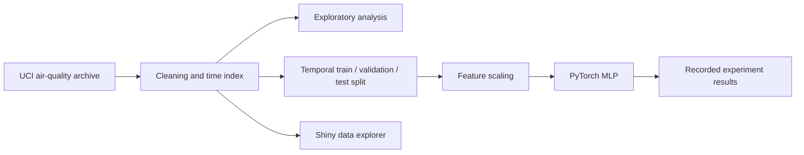

# Air-Quality ML Pipeline and Data Explorer

[Back to Programming in Python II](../README.md) · [Coursework portfolio](../../../README.md)

This individual coursework project connects data ingestion, time-indexed preprocessing, exploratory analysis, PyTorch regression, hyperparameter experiments, and a Shiny for Python data explorer for Beijing PM2.5 data.

## System overview

## Recorded experiment

The committed course output contains four MLP configurations:

| Hidden layers | Dropout | Learning rate | Epochs | Validation MSE | Test MSE |
| --- | ---: | ---: | ---: | ---: | ---: |
| `(64, 32)` | 0.10 | `1e-3` | 150 | 213.39 | 646.30 |
| `(128, 64)` | 0.20 | `1e-3` | 200 | 203.74 | **589.64** |
| `(256, 128)` | 0.10 | `5e-4` | 200 | **203.39** | 626.78 |
| `(64,)` | 0.00 | `1e-3` | 100 | 232.94 | 633.74 |

The lowest validation MSE belongs to `(256, 128)`. Another configuration has a lower recorded test MSE, but comparing test scores to choose a model would leak test information into model selection. The table is retained as an archival course result, not presented as a production benchmark.

## Main components

| Component | Responsibility |
| --- | --- |
| [`a6_ex1.py`](a6_ex1.py) | Download/extraction workflow, station selection, cleaning, and time index. |
| [`a6_ex2.py`](a6_ex2.py) | Exploratory plots and correlation analysis. |
| [`a6_ex3.py`](a6_ex3.py) | Temporal splits, scaling, and PyTorch data loaders. |
| [`a6_ex4.py`](a6_ex4.py) | Configurable multilayer regressor. |
| [`a6_ex5.py`](a6_ex5.py) | Training, validation, prediction, and artifact persistence. |
| [`a6_ex6.py`](a6_ex6.py) | Four-configuration experiment loop and result export. |
| [`app.py`](app.py) | Interactive pollutant visualization for CSV input with a parseable `datetime` column. |
| [`a6_ex6.txt`](a6_ex6.txt) | Preserved experiment table shown above. |

## Engineering review

The project demonstrates an end-to-end workflow, but the preserved coursework implementation should not be deployed unchanged:

- Missing-value interpolation occurs before the temporal split, so future observations can influence earlier rows.
- Every configuration is evaluated on the test set instead of reserving it for one final evaluation.
- The model/scaler feature schema is inferred rather than stored and validated explicitly.
- The experiment has no naive, linear, or seasonal baseline for context.

The original course dashboard accepted uploaded pickle and model files. The public portfolio edition removes that unsafe deserialization path and keeps model training separate from the CSV visualization interface. Device selection in the experiment script was also made portable across CUDA, Apple MPS, and CPU environments; neither change alters the recorded results above.

These limitations were identified during the public-portfolio review. This refactor documents them rather than retraining the model or retroactively replacing the recorded result.

## Reproducibility notes

The cleaned CSV and source files are retained for inspection, but the original environment was not locked. Reproduction requires Python with pandas, NumPy, scikit-learn, PyTorch, Matplotlib, and Shiny for Python.

A production follow-up should move preprocessing behind the split boundary, select on validation data only, package a trusted model with a versioned schema, and add baseline metrics and tests.
