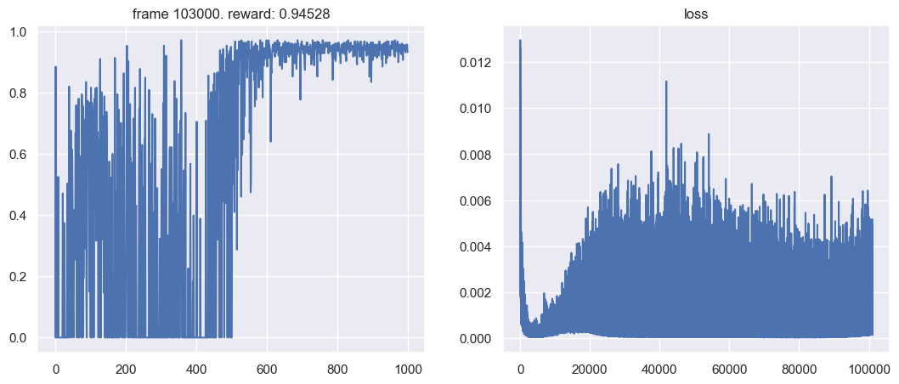

# MiniGrid DQN

[Back to Deep Reinforcement Learning](../README.md) · [Coursework portfolio](../../../README.md)

This project trains a value-based agent for the partially observable `MiniGrid-DoorKey-6x6-v0` environment. The agent must find a key, unlock a door, and reach the goal from image-like observations.

## Recorded result

The preserved course run reached a **50-episode average score of 0.94** at episodes 900 and 950. This is an archival result from the committed notebook output; the portfolio cleanup did not retrain or re-evaluate the model.

The plot shows the raw episodic reward and optimization loss from the recorded 1,000-episode run. Reward becomes consistently high after the exploratory phase, while occasional failures remain visible.

## What was implemented

- A replay buffer for off-policy transition sampling.
- An epsilon-greedy policy with scheduled exploration.
- A multilayer Q-network operating on `3 × 7 × 7` observations.
- Double-DQN-style target selection: the online network selects the next action and the target network evaluates it.
- Soft target-network updates with `tau = 1e-3`.
- Checkpoint storage and separate evaluation utilities.

## Main artifacts

| Artifact | Purpose |
| --- | --- |
| [`Minigrid_DQN_exercise_2024.ipynb`](Minigrid_DQN_exercise_2024.ipynb) | Implementation, recorded training run, and analysis. |
| [`minigrid_eval.py`](minigrid_eval.py) | Original ONNX-oriented evaluation environment and agent interface. |

## Reproducibility notes

The notebook was originally executed in a course/Colab environment with PyTorch, Gymnasium, MiniGrid, ONNX, and visualization utilities. The public edition removes platform-setup and submission-prompt cells while retaining the implementation and recorded output; it is not presented as a one-command production training package.

`minigrid_eval.py` expects an ONNX model, but no model artifact is published in this portfolio. The script is retained as implementation evidence rather than presented as a directly runnable evaluator.

The current public artifact is best read as evidence of the algorithm and the completed experiment. A production version would separate the agent, replay buffer, configuration, training loop, and evaluation into tested modules; pin dependencies; remove Colab-specific setup; and evaluate across multiple seeds.

## Limitations

- The reported score is from one recorded run rather than a multi-seed benchmark.
- There is no random-policy or alternative-agent baseline in the preserved result.
- The notebook remains an archival experiment rather than a packaged training application.
- No model artifact or locked environment is retained for independent evaluation.

These limitations are stated explicitly so the result is not interpreted as a broader benchmark claim.
