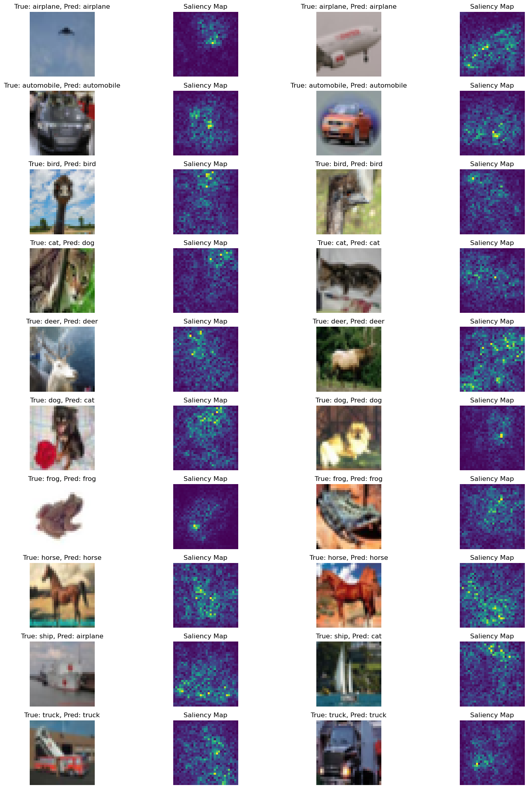
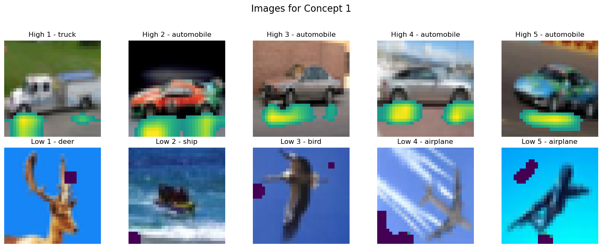
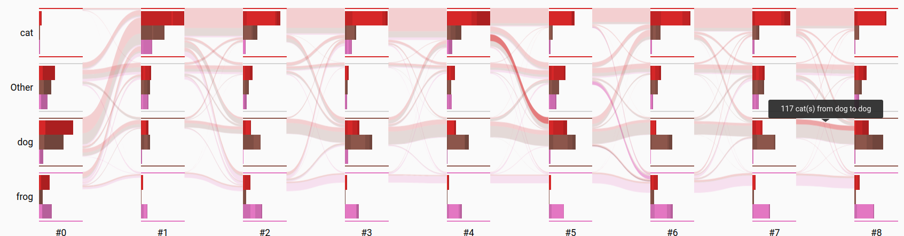

# Explaining a CIFAR-10 Classifier

[Back to Explainable AI](../README.md) · [Coursework portfolio](../../../README.md)

This project investigates what a convolutional image classifier learns and why it makes particular errors. It combines local pixel-level explanations, unsupervised concept discovery, and instance-level training analysis rather than relying on a single explanation method.

## Project context and ownership

This was a four-person JKU coursework project. Giovanni Filomeno's recorded contribution was **25% of the submitted work**. The original submission did not attribute individual components, so the results below are presented as team results and no more specific ownership is inferred.

Personal identifiers and the original classroom invitation were removed from this public portfolio edition. A previously linked team presentation is intentionally not redistributed here.

## Model result

The preserved evaluation output reports **82.59% overall test accuracy** for the CNN used in the main explanation workflow. Per-class accuracy ranges from **64.30% for cats** to **92.00% for automobiles**, making the weaker animal classes useful targets for explanation.

The InstanceFlow section contains a separate training run with **83.87% overall test accuracy**. These numbers describe two recorded notebook workflows and should not be treated as a controlled model comparison.

## Explanation methods

| Method | Question | Main observation |
| --- | --- | --- |
| Saliency maps | Which pixels most affect a prediction? | Important regions often overlap the object, but explanations are noisy at CIFAR-10's `32 × 32` resolution. |
| SHAP | Which regions contribute positively or negatively? | Local contributions provide more detail, at substantially higher computational cost. |
| Invertible concept-based explanations | Which latent concepts appear in a convolutional layer? | Vehicle concepts were often more concrete, while several animal concepts were dominated by color and texture. |
| InstanceFlow | How do individual predictions change during training? | Cat examples frequently flowed toward dog and frog predictions in the recorded run. |

## Visual evidence

### Saliency maps

### Unsupervised concept examples

The highlighted regions below are examples with high and low activation for one discovered concept. The concept appears strongly associated with road or concrete regions in vehicle images, illustrating both the value and ambiguity of post-hoc concept labeling.

### Instance-level error flow

## Main artifacts

| Artifact | Purpose |
| --- | --- |
| [`submission-notebook.ipynb`](submission-notebook.ipynb) | Integrated explanation workflow and recorded outputs. |
| [`ConceptExtractor.py`](ConceptExtractor.py) | NMF-based concept extraction utilities. |
| [`ncav_utils.py`](ncav_utils.py) | Concept activation and TCAV-style analysis helpers. |
| [`ex2_cifar10_explainability/`](ex2_cifar10_explainability) | Classifier, dataset, and saliency utilities. |
| [`ex2_cifar10_shap/`](ex2_cifar10_shap) | SHAP-focused analysis notebook. |
| [`environment.yml`](environment.yml) | Original Conda environment description. |

## Reproducibility notes

The public portfolio keeps the completed notebooks, source utilities, and representative figures. The trained model used by the original notebook is not included, so the committed notebook output is the primary evidence for the recorded result. This portfolio refactor did not retrain the classifier.

Reproducing the full workflow requires recreating the Conda environment, obtaining CIFAR-10 through `torchvision`, and training or supplying a compatible checkpoint. Large InstanceFlow JSON exports are generated artifacts rather than source code.

## Limitations

- Saliency and SHAP explanations are post-hoc and do not establish causal reasoning.
- Concept discovery depends strongly on the selected layer, NMF initialization, and requested number of concepts.
- Human labels assigned to unsupervised concepts remain subjective.
- The project is team work; individual component ownership is not available in the preserved submission.

The most useful outcome is therefore comparative: different explanation methods expose complementary failure modes, while each carries distinct assumptions and uncertainty.
